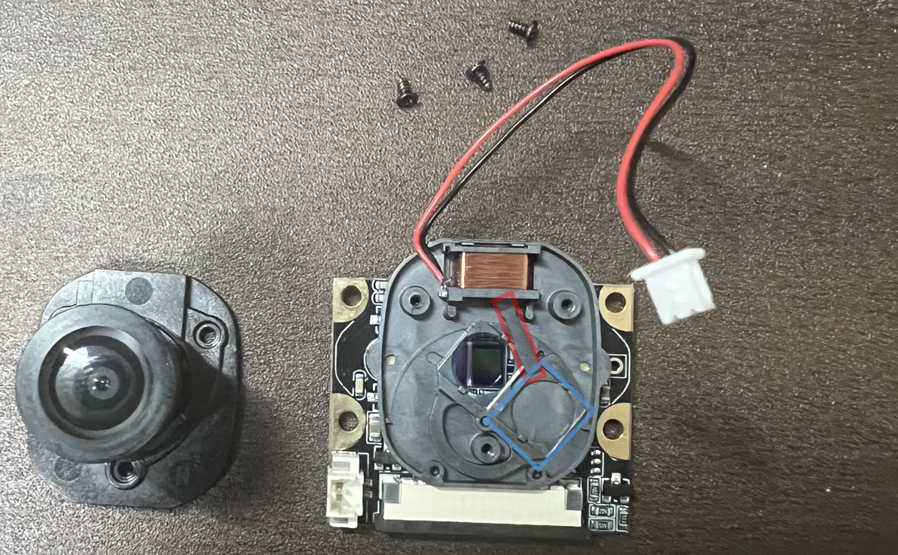

# InfraCamControl

**Other Language Versions: [English](README.md) | [中文](README_zh.md) | [日本語](README_jp.md)**

---

## Table of Contents

- [InfraCamControl](#infracamcontrol)
  - [Table of Contents](#table-of-contents)
  - [Overview](#overview)
  - [Features](#features)
  - [Hardware Requirements](#hardware-requirements)
    - [PiCamera2 Module Filter Adjustment](#picamera2-module-filter-adjustment)
  - [Software Requirements](#software-requirements)
  - [Installation Guide](#installation-guide)
  - [Usage Instructions](#usage-instructions)
  - [System Architecture](#system-architecture)
  - [Face Detection Solutions](#face-detection-solutions)
  - [Hardware Connections](#hardware-connections)
  - [Contributing](#contributing)
  - [License](#license)
  - [Troubleshooting](#troubleshooting)
  - [Acknowledgements](#acknowledgements)

---

## Overview

InfraCamControl is an innovative Raspberry Pi-based system that combines infrared remote control functionality with computer vision technology for automated camera control. The system receives commands through Slack, controls infrared devices, automatically adjusts infrared lighting based on ambient light, and integrates with Apple devices for voice control and other smart features.

---

## Features

- **Remote Control**: Efficient remote management through Slack integration.
- **Infrared Learning and Sending**: Supports learning and sending infrared signals.
- **Computer Vision**:
  - OpenCV Haar Cascade
  - YOLOv8
  - Ultra-Light-Fast
- **Ambient Light Management**: Automatically adjusts infrared lighting based on lighting conditions.
- **Multitasking Support**: Multi-threaded processing to enhance performance.
- **Protocol Compatibility**: Supports NEC and Mitsubishi infrared signal protocols.
- **Apple Device Integration**: Enables intelligent control via voice recognition.

---

## Hardware Requirements

- **Raspberry Pi** (Model 4B)
- **PiCamera2** (OV5647 IR-CUT)
- **Infrared LED Emitters** (OSI5FU5111C-40 940nm) ×3
- **Green LED Indicator** (OSG8HA3Z74A)
- **Infrared Receiver Module** (OSRB38C9AA)
- **N-channel MOSFET** (2SK2232)
- **Slide Switch**
- **Button**
- **Resistors**:
  - 100Ω (±5%) ×4
  - 10kΩ (±5%) ×1

<div style="display: flex; justify-content: space-between;">
  
  
</div>
<br>
<div style="display: flex; justify-content: space-between;">
  
  
</div>

---

### PiCamera2 Module Filter Adjustment

**Note**: The OV5647 IR-CUT module does not automatically switch infrared filters and must be manually removed. Follow these steps for safe disassembly:

1. **Remove Screws and Connectors**  
   Unscrew the red-marked screws and disconnect the blue-marked connectors.  
   

2. **Adjust Filter and Lever**  
   Move the blue-marked filter to the target position and slightly lift the red-marked lever, keeping it in place. Re-tighten the screws without needing to reconnect the connectors.
   <div style="display: flex; justify-content: space-between;">
   
   
   </div>

---

## Software Requirements

- **Python 3.x**
- Required Python Packages (install via pip):
  - `picamera2`
  - `opencv-python`
  - `pigpio`
  - `slack-sdk`
  - `numpy`
  - `onnxruntime` (for Ultra-Light-Fast model)
  - `ultralytics` (for YOLOv8)

---

## Installation Guide

1. **Clone the Repository**

   ```bash
   git clone https://github.com/CC5103/InfraCamControl.git
   cd InfraCamControl
   ```

2. **Install Dependencies**

   ```bash
   pip install -r requirements.txt
   ```

3. **Configure Slack Integration**  
   Create a `config.json` file and add your Slack credentials:

   ```json
   {
     "BOT_TOKEN": "your-slack-bot-token",
     "ID": "your-channel-id"
   }
   ```

---

## Usage Instructions

1. **Start the pigpio Daemon**

   ```bash
   sudo pigpiod
   ```

2. **Run the Main Program**

   ```bash
   python main.py
   ```

3. **Create Infrared Signal**  
   Input the following command in Slack to record a signal:

   ```bash
   crate <save_type> <save_key> <save_name>
   ```

   - **Hardware Operation**: Set the switch to the infrared receiver and press the button to record the signal.
   - **Signal Protocol**: Supports NEC or Mitsubishi protocol (940nm).
   - **File Management**: The system automatically generates signal files and updates them in `signal_list.json`.

4. **Send Infrared Signal**  
   In Slack, input `<save_key>` to trigger the signal transmission.  
   **Tip**: Press the circuit button to test hardware functionality.

---

## System Architecture

The system consists of two main threads:

1. **Slack Message Thread**

   - Listens for commands
   - Manages infrared signal recording and transmission

2. **Camera Thread**
   - Face detection
   - Ambient light monitoring and infrared light adjustment

---

## Face Detection Solutions

The system offers three face detection implementations that can be selected based on your needs:

### 1. OpenCV Haar Cascade (main.py)

- Based on traditional Haar feature classifier
- Pros:
  - Fast execution
  - Low resource usage
  - No additional dependencies required
- Cons:
  - Lower accuracy
  - Sensitive to lighting conditions
- Use case: Environments with limited resources

### 2. YOLOv8 (main_yolo.py)

- Based on the latest YOLOv8 deep learning model
- Pros:
  - High detection accuracy
  - Robust
  - Supports multi-object detection
- Cons:
  - Higher resource usage
  - Requires model download
- Use case: High-precision applications

### 3. Ultra-Light-Fast (main_ultralight.py)

- Based on a lightweight neural network model
- Pros:
  - Fast detection
  - Moderate resource usage
  - Good accuracy
- Cons:
  - Requires model download
  - Supports single-face detection only
- Use case: Balancing performance and resource usage

---

## Hardware Connections

Key GPIO Interface Descriptions:

- **GPIO25**: Infrared LED Emitter
- **GPIO23**: Infrared Receiver Module
- **CSI Interface**: Camera Module Connection
- **Status LED**: Displays system status

---

## Contributing

1. Fork the repository
2. Create a branch
   ```bash
   git checkout -b feature/AmazingFeature
   ```
3. Commit changes
   ```bash
   git commit -m 'Add some AmazingFeature'
   ```
4. Push the branch
   ```bash
   git push origin feature/AmazingFeature
   ```
5. Submit a Pull Request

---

## License

This project is released under the GNU General Public License (GPL). See the `LICENSE` file for details.

---

## Troubleshooting

- Ensure that the `pigpiod` service is running.
- Check if the Slack configuration is correct.
- Verify hardware connections.
- Confirm that the camera module is enabled.

---

## Acknowledgements

- Thanks to the **pigpio** and **OpenCV** development teams for their support.
- Special thanks to:
  - [yhotta240's Infrared Tutorial](https://qiita.com/yhotta240/items/df0f2f92b5dff1d9410b)
  - [Casareal BS Blog's Air Conditioner Remote Tutorial](https://bsblog.casareal.co.jp/archives/5010)
  - [Ultra-Light-Fast-Generic-Face-Detector-1MB](https://github.com/Linzaer/Ultra-Light-Fast-Generic-Face-Detector-1MB)
  - [YOLOv8](https://github.com/ultralytics/ultralytics)
  - [OpenCV](https://opencv.org/)
