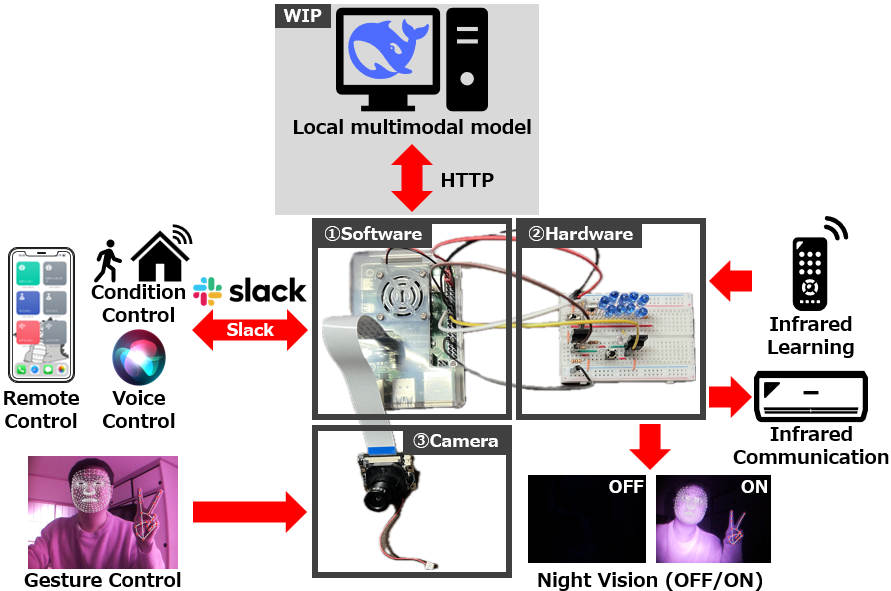
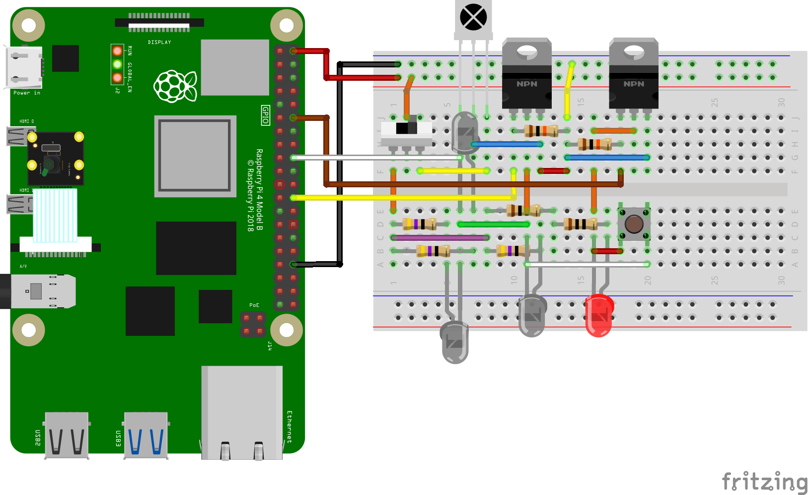
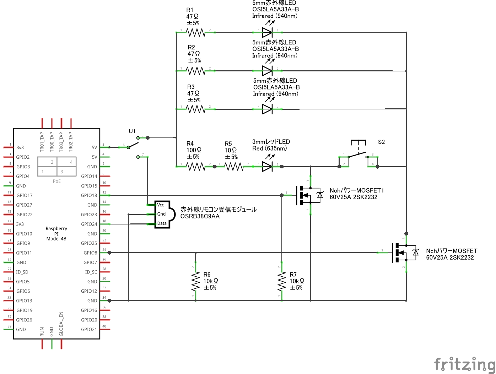
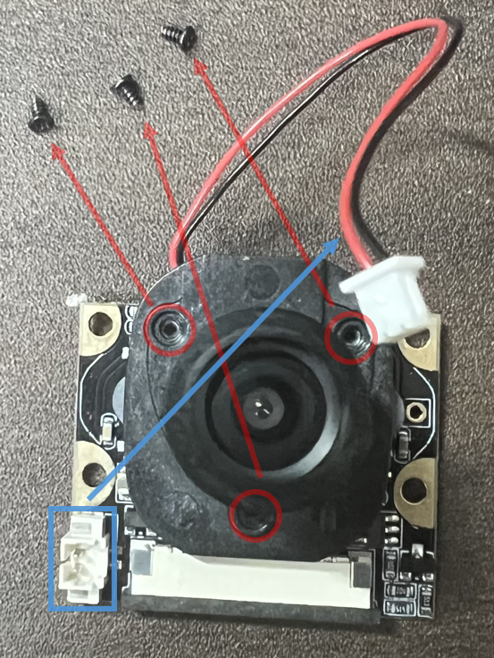
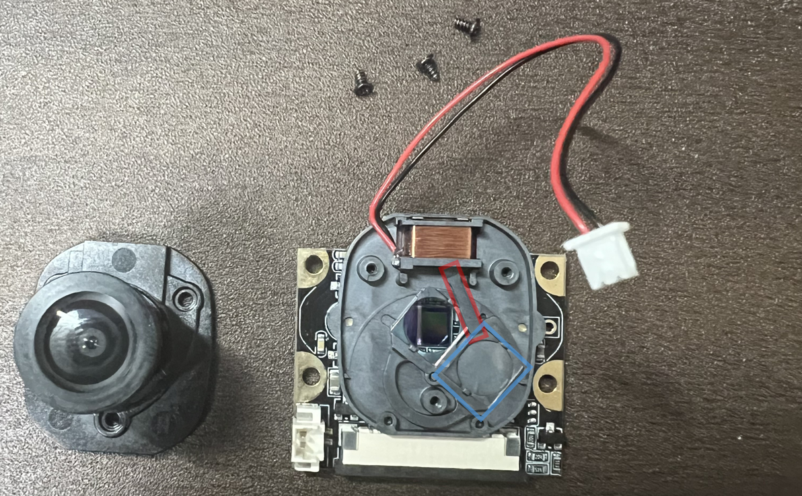
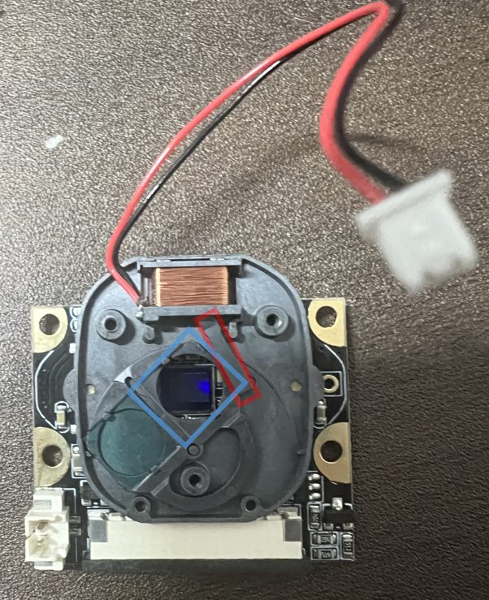

# InfraCamControl

**Other Language Versions: [English](README.md) | [中文](README_zh.md) | [日本語](README_jp.md)**

---

## 目次

- [InfraCamControl](#infracamcontrol)
  - [目次](#目次)
  - [概要](#概要)
  - [機能](#機能)
  - [ハードウェア要件](#ハードウェア要件)
    - [ハードウェア図](#ハードウェア図)
    - [PiCamera2 モジュールのフィルター調整](#picamera2-モジュールのフィルター調整)
  - [ソフトウェア要件](#ソフトウェア要件)
  - [インストールガイド](#インストールガイド)
  - [使用方法](#使用方法)
  - [システムアーキテクチャ](#システムアーキテクチャ)
  - [顔検出ソリューション](#顔検出ソリューション)
    - [1. OpenCV Haar Cascade](#1-opencv-haar-cascade)
    - [2. YOLOv8](#2-yolov8)
    - [3. Ultra-Light-Fast](#3-ultra-light-fast)
    - [4. MediaPipe Face Mesh](#4-mediapipe-face-mesh)
  - [手のジェスチャー認識](#手のジェスチャー認識)
  - [ハードウェア接続](#ハードウェア接続)
  - [貢献](#貢献)
  - [ライセンス](#ライセンス)
  - [トラブルシューティング](#トラブルシューティング)
  - [謝辞](#謝辞)

---

## 概要

InfraCamControl は、Raspberry Pi をベースにした多機能スマートカメラ制御システムで、赤外線リモコン、コンピュータビジョン、ジェスチャー認識技術を統合しています。Slack を通じて指示を受け取り、赤外線機器の制御、顔検出、ジェスチャー認識をサポートし、周囲の光条件に応じて赤外線照明を自動的に調整します。また、Apple デバイスとの音声インタラクションもサポートし、よりインテリジェントなデバイス操作を実現します。

</img>

---

## 機能

- **リモートコントロール**: Slack を通じた効率的なリモート管理。
- **赤外線信号の学習と送信**: 赤外線信号の学習および送信をサポート。
- **コンピュータビジョン**:
  - 複数の顔検出方法をサポート。
  - リアルタイムの手のジェスチャー認識。
- **環境光管理**: 周囲の光に応じて赤外線照明を自動的に調整。
- **マルチタスク**: マルチスレッドをサポートして効率を向上。
- **プロトコル互換性**: NEC および三菱の赤外線プロトコルに対応。
- **Apple デバイス統合**: 音声認識を通じて賢いコントロールが可能。

---

## ハードウェア要件

- **Raspberry Pi** (モデル 4B)
- **PiCamera2** (OV5647 IR-CUT)
- **赤外線 LED エミッター** (OSI5LA5A33A-B 940nm) ×9
- **赤色 LED インジケータライト** (2.3V, 25mA)
- **ダイオード**（1N5819）
- **赤外線受信モジュール** (OSRB38C9AA)
- **N チャンネル MOSFET** (2SK2232) ×2
- **スライドスイッチ**
- **ボタン**
- **抵抗器**:
  - 2.2Ω (±5%) ×3
  - 10Ω (±5%) ×1
  - 100Ω (±5%) ×1
  - 10kΩ (±5%) ×2

### ハードウェア図

<div style="display: flex; justify-content: space-between;">
  
  
</div>
<br>
<div style="display: flex; justify-content: space-between;">
  
  
</div>

---

### PiCamera2 モジュールのフィルター調整

**注意**: OV5647 IR-CUT モジュールは赤外線フィルターを自動的に切り替えることができず、手動で取り外す必要があります。非破壊的な分解方法は以下の通りです。

1. **ネジとコネクタを外す**  
   赤色で示されたネジを外し、青色で示されたコネクタを抜きます。  
   

2. **フィルターとレバーを調整**  
   青色で示されたフィルターを目標位置に移動させ、赤色で示されたレバーを優しく持ち上げて、元に戻します。コネクタを再接続せず、ネジを再取り付けます。
   <div style="display: flex; justify-content: space-between;">
   
   
   </div>

---

## ソフトウェア要件

- **Python 3.x**
- 必要な Python パッケージ（pip でインストール）:
  - `picamera2`
  - `opencv-python`
  - `pigpio`
  - `slack-sdk`
  - `numpy`
  - `onnxruntime` (Ultra-Light-Fast モデル用)
  - `ultralytics` (YOLOv8 用)
  - `mediapipe`

---

## インストールガイド

1. **リポジトリをクローン**

   ```bash
   git clone https://github.com/CC5103/InfraCamControl.git
   cd InfraCamControl
   ```

2. **依存パッケージのインストール**

   ```bash
   pip install -r requirements.txt
   ```

3. **Slack 設定の構成**  
   `config.json` ファイルを作成し、Slack の資格情報を追加します。
   ```json
   {
     "BOT_TOKEN": "your-slack-bot-token",
     "ID": "your-channel-id"
   }
   ```

---

## 使用方法

1. **pigpio デーモンを起動**

   ```bash
   sudo pigpiod
   ```

2. **メインプログラムを実行**

   ```bash
   python3 InfraCamControl/software/main_mediapipe.py
   ```

3. **赤外線信号の作成**  
   Slack で以下のコマンドを入力して信号を記録します。

   ```bash
   crate <save_type> <save_key> <save_name>
   ```

   - **ハードウェア操作**: スイッチを赤外線受信機に設定し、ボタンを押して信号を記録。
   - **信号プロトコル**: NEC または三菱のプロトコル（940nm）に対応。
   - **ファイル管理**: システムは信号ファイルを自動生成し、`signal_list.json` に追加します。

4. **赤外線信号の送信**

   - **Slack 操作**: `<save_key>`を入力して信号を送信（ボタンを押して赤色インジケーターが点灯することを確認）。
   - **ジェスチャー操作**: 手のジェスチャーを使用して、バインドされた信号を送信（指を広げることでシステムが起動し、その後赤色ライトが自動的に点灯します。システムが起動したら、対応するジェスチャーを実行）。

---

## システムアーキテクチャ

システムは 2 つのメインスレッドで構成されています：

1. **Slack メッセージスレッド**

   - コマンドを受信
   - 赤外線信号の記録と送信の管理

2. **カメラスレッド**

   - 顔検出
   - 環境光の監視と赤外線ライト調整

---

## 顔検出ソリューション

システムは以下の顔検出方法を提供します：

### 1. OpenCV Haar Cascade

- **利点**: 高速、リソース消費が少ない。
- **欠点**: 精度が低く、照明条件に敏感。
- **使用例**: リソース制限のある環境。

### 2. YOLOv8

- **利点**: 高精度な検出、複数ターゲット検出をサポート。
- **欠点**: 高いリソース消費。
- **使用例**: 高精度を必要とするアプリケーション。

### 3. Ultra-Light-Fast

- **利点**: 高速、適度なリソース消費。
- **欠点**: 単一の顔のみ検出。
- **使用例**: バランスの取れたパフォーマンス。

### 4. MediaPipe Face Mesh

- **利点**: 高精度、複数の人の検出をサポート。
- **欠点**: 高い計算リソースが必要。
- **使用例**: 詳細な特徴分析が必要なアプリケーション。

---

## 手のジェスチャー認識

システムは MediaPipe を使用してリアルタイムの手のジェスチャー認識を行います。サポートされるジェスチャーは以下の通りです：

- **開いた手**: システムを起動、赤色ライトが点灯。
- **人差し指**: ライトのオン/オフ。
- **人差し指と中指**: エアコンのオン。
- **人差し指、中指、薬指**: エアコンのオフ。

---

## ハードウェア接続

主要 GPIO インターフェースの説明：

- **GPIO8**: 赤外線 LED エミッター
- **GPIO25**: 赤外線受信モジュール
- **GPIO23**: ジェスチャー認識フィードバック（赤色インジケーターを点灯）
- **CSI インターフェース**: カメラモジュール接続
- **ステータス LED**: システムステータスを表示

---

## 貢献

1. リポジトリをフォーク。
2. 新しいブランチを作成。
   ```bash
   git checkout -b feature/AmazingFeature
   ```
3. 変更をコミット。
   ```bash
   git commit -m 'Add some AmazingFeature'
   ```
4. ブランチをプッシュ。
   ```bash
   git push origin feature/AmazingFeature
   ```
5. プルリクエストを提出。

---

## ライセンス

このプロジェクトは GNU General Public License (GPL) の下でライセンスされています。詳細については、`LICENSE` ファイルをご覧ください。

---

## トラブルシューティング

- `pigpiod` サービスが実行中か確認。
- Slack の設定が正しいか確認。
- ハードウェア接続を確認。
- カメラモジュールが有効か確認。

---

## 謝辞

- [yhotta240 の赤外線チュートリアル](https://qiita.com/yhotta240/items/df0f2f92b5dff1d9410b)
- [Casareal BS Blog のエアコンリモコンチュートリアル](https://bsblog.casareal.co.jp/archives/5010)
- [Ultra-Light-Fast-Generic-Face-Detector-1MB](https://github.com/Linzaer/Ultra-Light-Fast-Generic-Face-Detector-1MB)
- [YOLOv8](https://github.com/ultralytics/ultralytics)
- [OpenCV](https://opencv.org/)
- [Google MediaPipe](https://github.com/google/mediapipe)

---
