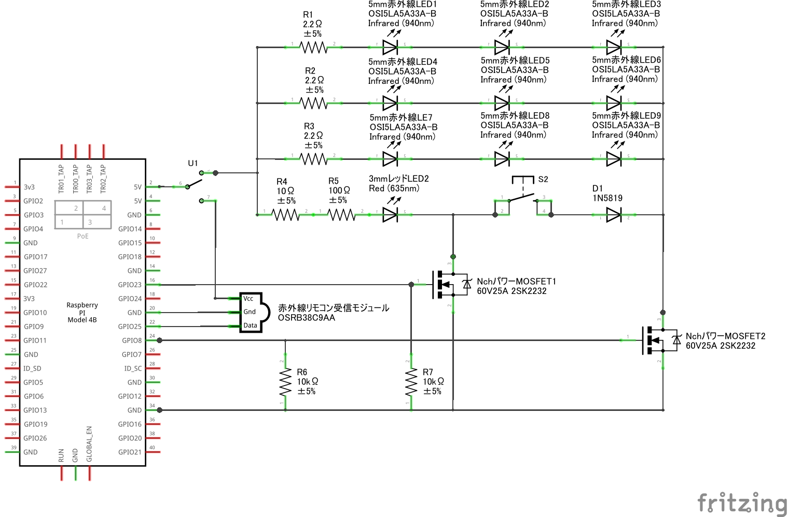

# InfraCamControl

**Other Language Versions: [English](README.md) | [中文](README_zh.md) | [日本語](README_jp.md)**

---

## 目次

1. [概要](#概要)
2. [特徴](#特徴)
3. [ハードウェア要件](#ハードウェア要件)
   - [PiCamera2 モジュールフィルタ調整](#picamera2-モジュールフィルタ調整)
4. [ソフトウェア要件](#ソフトウェア要件)
5. [インストールガイド](#インストールガイド)
6. [使用方法](#使用方法)
7. [システムアーキテクチャ](#システムアーキテクチャ)
8. [顔検出の手法](#顔検出の手法)
9. [手のジェスチャー認識](#手のジェスチャー認識)
10. [ハードウェア接続](#ハードウェア接続)
11. [貢献方法](#貢献方法)
12. [ライセンス](#ライセンス)
13. [トラブルシューティング](#トラブルシューティング)
14. [謝辞](#謝辞)

---

## 概要

InfraCamControl は、Raspberry Pi を基盤とした多機能スマートカメラ制御システムです。赤外線リモコン、コンピュータビジョン、およびジェスチャー認識技術を統合しており、Slack を通じたコマンド受信、赤外線機器の制御、顔や手の動き認識、さらに環境光に応じた赤外線照明の自動調整機能を提供します。また、Apple デバイスとの音声連携により、よりスマートなデバイス操作が可能です。

---

## 特徴

- **リモート制御**: Slack 経由で効率的な遠隔管理を実現。
- **赤外線学習と送信**: 赤外線信号の学習と送信をサポート。
- **コンピュータビジョン**:
  - 複数の顔検出手法をサポート。
  - リアルタイムで手のジェスチャーを認識。
- **環境光管理**: 光量に応じた赤外線照明の自動調整機能。
- **マルチタスク対応**: マルチスレッド処理で動作効率を向上。
- **プロトコル互換性**: NEC および三菱の赤外線信号プロトコルをサポート。
- **Apple デバイスとの連携**: 音声認識を用いてより高度な制御を実現。

---

## ハードウェア要件

- **Raspberry Pi** (Model 4B)
- **PiCamera2** (OV5647 IR-CUT)
- **赤外線 LED エミッター** (OSI5FU5111C-40 940nm) ×3
- **緑色 LED インジケータ** (OSG8HA3Z74A)
- **赤外線受信モジュール** (OSRB38C9AA)
- **N チャンネル MOSFET** (2SK2232)
- **スライドスイッチ**
- **ボタン**
- **抵抗器**:
  - 100Ω (±5%) ×4
  - 10kΩ (±5%) ×1

### ハードウェアのイメージ

<div style="display: flex; justify-content: space-between;">
  
  
</div>
<br>
<div style="display: flex; justify-content: space-between;">
  
  
</div>

---

### PiCamera2 モジュールフィルタ調整

**注意**: OV5647 IR-CUT モジュールは赤外線フィルタの自動切り替えができません。フィルタを手動で取り外す必要があります。以下はフィルタの無損失取り外し手順です：

1. **ネジとコネクタの取り外し**  
   赤いマークのネジを外し、青いマークのコネクタを抜いてください。  
   

2. **フィルタとレバーの調整**  
   青いマークのフィルタを目標位置に移動し、赤いマークのレバーをわずかに持ち上げて固定します。その後、ネジを締め直し、コネクタは接続しなくても問題ありません。
   <div style="display: flex; justify-content: space-between;">
   
   
   </div>

---

## ソフトウェア要件

- **Python 3.x**
- 必要な Python パッケージ（pip でインストール可能）:
  - `picamera2`
  - `opencv-python`
  - `pigpio`
  - `slack-sdk`
  - `numpy`
  - `onnxruntime` (Ultra-Light-Fast モデル用)
  - `ultralytics` (YOLOv8 用)
  - `mediapipe`

---

## インストールガイド

1. **リポジトリをクローン**

   ```bash
   git clone https://github.com/CC5103/InfraCamControl.git
   cd InfraCamControl
   ```

2. **依存関係をインストール**

   ```bash
   pip install -r requirements.txt
   ```

3. **Slack の統合を設定**  
   `config.json` ファイルを作成し、Slack の認証情報を追加します：

   ```json
   {
     "BOT_TOKEN": "your-slack-bot-token",
     "ID": "your-channel-id"
   }
   ```

---

## 使用方法

1. **pigpio デーモンを起動**

   ```bash
   sudo pigpiod
   ```

2. **メインプログラムを実行**

   ```bash
   python main_mediapipe.py
   ```

3. **赤外線信号を作成**  
   Slack で以下のコマンドを入力し、信号を記録：

   ```bash
   crate <save_type> <save_key> <save_name>
   ```

   - **ハードウェア操作**：スイッチを赤外線受信機に切り替え、ボタンを押して信号を記録します。
   - **信号プロトコル**：NEC または三菱プロトコル（940nm）に対応。
   - **ファイル管理**：システムは自動で信号ファイルを生成し、`signal_list.json`に更新します。

4. **赤外線信号を送信**

   - **Slack で操作**：`<save_key>` を入力して信号を送信します。
   - **ジェスチャーで操作**：手のジェスチャー認識により、信号を送信（手のひらを開いた状態で対応するジェスチャーを行う）。

---

## システムアーキテクチャ

システムは以下の 2 つの主要スレッドで構成されています：

1. **Slack メッセージスレッド**

   - コマンドの監視
   - 赤外線信号の記録と送信の管理

2. **カメラスレッド**
   - 顔検出
   - 環境光の監視と赤外線照明の調整

---

## 顔検出の手法

システムは以下の 4 つの顔検出方法を提供します：

### 1. OpenCV Haar Cascade

- **メリット**：処理速度が速く、リソース消費が少ない。
- **デメリット**：精度が低く、照明条件に敏感。
- **適用シーン**：リソースが限られた環境。

### 2. YOLOv8

- **メリット**：検出精度が高く、複数のターゲット検出をサポート。
- **デメリット**：リソース消費が高い。
- **適用シーン**：高精度を求めるアプリケーション。

### 3. Ultra-Light-Fast

- **メリット**：処理が高速で、リソース消費が中程度。
- **デメリット**：単一の顔検出のみ対応。
- **適用シーン**：性能とリソース要求のバランスが必要な場合。

### 4. MediaPipe Face Mesh

- **メリット**：高精度で、複数の顔検出に対応。
- **デメリット**：計算リソースの要求が高い。
- **適用シーン**：精細な特徴分析が必要なアプリケーション。

---

## 手のジェスチャー認識

MediaPipe を活用して、リアルタイムで手のジェスチャーを認識します。以下のジェスチャー制御をサポート：

- **人差し指**：状態を"0"に切り替え。
- **人差し指 + 中指**："on"状態でデバイスを起動。
- **人差し指 + 中指 + 薬指**："off"状態でデバイスを停止。
- **全指を開く**："start"状態でシステムを起動。

---

## ハードウェア接続

主要な GPIO インターフェースの説明：

- **GPIO25**：赤外線 LED エミッター
- **GPIO23**：赤外線受信モジュール
- **CSI インターフェース**：カメラモジュールの接続
- **ステータス LED**：システム動作状況の表示

---

## 貢献方法

1. リポジトリを Fork します。
2. 新しいブランチを作成：

   ```bash
   git checkout -b feature/AmazingFeature
   ```

3. 変更をコミット：

   ```bash
   git commit -m 'Add some AmazingFeature'
   ```

4. ブランチをプッシュ：

   ```bash
   git push origin feature/AmazingFeature
   ```

5. Pull Request を送信します。

---

## ライセンス

本プロジェクトは GNU General Public License（GPL）に基づいて公開されています。詳細は`LICENSE`ファイルをご覧ください。

---

## トラブルシューティング

- `pigpiod`サービスが起動していることを確認してください。
- Slack の設定が正しいか確認してください。
- ハードウェア接続を検証してください。
- カメラモジュールが有効化されていることを確認してください。

---

## 謝辞

- [yhotta240 の赤外線チュートリアル](https://qiita.com/yhotta240/items/df0f2f92b5dff1d9410b)
- [Casareal BS ブログのエアコンリモコンチュートリアル](https://bsblog.casareal.co.jp/archives/5010)
- [Ultra-Light-Fast-Generic-Face-Detector-1MB](https://github.com/Linzaer/Ultra-Light-Fast-Generic-Face-Detector-1MB)
- [YOLOv8](https://github.com/ultralytics/ultralytics)
- [OpenCV](https://opencv.org/)
- [Google MediaPipe](https://github.com/google/mediapipe)

---
