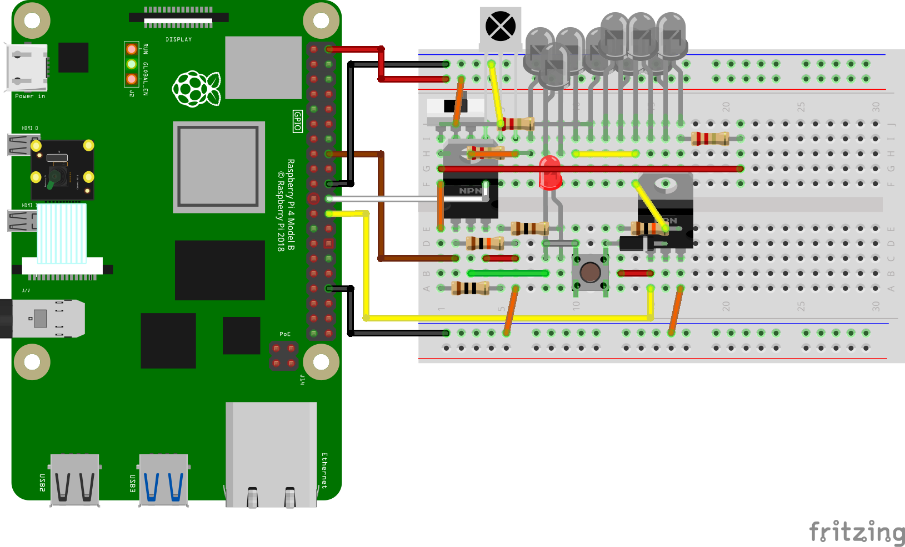

# InfraCamControl

**阅读其他语言版本：[英语](README.md)，[中文](README_zh.md)，[日本语](README_jp.md)。**

## 概述

InfraCamControl 是一个基于 Raspberry Pi 的系统，将红外遥控功能与计算机视觉相结合，用于自动化的相机控制。通过 Slack 接收命令，控制红外设备，并根据环境光照条件自动管理红外照明。系统还可以与苹果手机联动，通过语音识别或其他信息实现自动化处理，进一步提高智能化和便捷性。

## 特性

- **远程控制**：通过 Slack 集成实现远程控制
- **红外学习与发送**：支持红外信号的学习和发送功能
- **人脸检测**：使用计算机视觉技术识别目标
- **环境光管理**：自动调节红外照明以适应环境光条件
- **多线程支持**：并发处理多个任务，提升运行效率
- **协议支持**：支持 NEC 和三菱红外信号协议
- **苹果联动**：支持通过苹果设备进行语音识别和智能控制

## 硬件要求

- **Raspberry Pi** (Model 4B)
- **PiCamera2**
- **红外 LED 发射器**（OSI5FU5111C-40 940nm）x3
- **绿色 LED 指示灯**（OSG8HA3Z74A）
- **红外接收模块**（OSRB38C9AA）
- **N-channel MOSFET**（2SK2232）
- **按钮**
- **电阻器**：
  - 100Ω（±5%）x4
  - 10kΩ（±5%）x1

<div style="display: flex; justify-content: space-between;">
  
  
</div>
<br>
<div style="display: flex; justify-content: space-between;">
  
  
</div>

## 软件要求

- Python 3.x
- 所需的 Python 包（通过 pip 安装）：
  - picamera2
  - opencv-python
  - pigpio
  - slack-sdk
  - numpy

## 安装

1. 克隆仓库：
   ```bash
   git clone https://github.com/CC5103/InfraCamControl.git
   cd InfraCamControl
   ```

2. 安装依赖：
   ```bash
   pip install -r requirements.txt
   ```

3. 配置 Slack 集成：
   创建 `config.json` 文件并添加 Slack 凭证：
   ```json
   {
       "BOT_TOKEN": "your-slack-bot-token",
       "ID": "your-channel-id"
   }
   ```

## 使用方法

1. 启动 pigpio 守护进程：
   ```bash
   sudo pigpiod
   ```

2. 运行主程序：
   ```bash
   python main.py
   ```

3. **创建红外信号**：
   使用 Slack 命令录入信号：
   ```bash
   crate <save_type> <save_key> <save_name>
   ```
   说明：
   - 开关指向红外接收器，按下按钮收录信号。
   - 支持 NEC 或三菱协议的 940nm 红外信号。
   - 系统会自动生成信号文件，并更新 `<save_key>` 与 `<save_name>` 的映射至 `signal_list.json` 文件。

4. **发送红外信号**：
   在 Slack 中输入已保存的 `<save_key>`，触发信号发送以实现远程控制。

   **提示**：按下电路按钮可以测试硬件是否正常工作。

## 系统架构

系统分为两个主要线程：  

1. **Slack 消息线程**：
   - 监控 Slack 频道中的命令
   - 处理红外信号学习和发送任务  

2. **相机线程**：
   - 执行人脸检测
   - 监控环境光照水平
   - 自动调节红外照明

## 电路图

硬件应按照以下关键连接方式：  
- **GPIO25**：连接红外 LED 发射器
- **GPIO23**：连接红外接收模块
- **CSI 接口**：用于连接摄像头模块
- **状态 LED 指示灯**：显示系统状态

## 贡献

1. Fork 仓库
2. 创建特性分支：
   ```bash
   git checkout -b feature/AmazingFeature
   ```
3. 提交更改：
   ```bash
   git commit -m 'Add some AmazingFeature'
   ```
4. 推送分支：
   ```bash
   git push origin feature/AmazingFeature
   ```
5. 提交 Pull Request

## 许可证

此项目根据 GNU 通用公共许可证（GPL）授权。有关详情，请参阅 LICENSE 文件。

## 故障排除

- 确保在运行程序前已启动 pigpio 守护进程。
- 检查 Slack 机器人权限和令牌的有效性。
- 验证红外 LED 和接收模块的连接是否正确。
- 确保摄像头模块已启用并连接正常。

## 致谢

- 感谢 pigpio 开发者团队。
- 感谢 OpenCV 提供强大的人脸检测功能。
- 感谢 Slack API 开发团队提供的 Python SDK。
- 特别感谢 Qiita 用户 yhotta240 的红外遥控教程 [来源](https://qiita.com/yhotta240/items/df0f2f92b5dff1d9410b)。
- 致谢 Casareal BS 博客的空调遥控教程 [来源](https://bsblog.casareal.co.jp/archives/5010)。